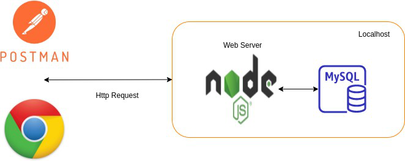

# **GRAN VIRUS EPICENTER (GVE)**

PR1 MANEJO E IMPLEMENTACION DE ARCHIVOS

HORACIO CIRAIZ ORELLANA

BASE DE DATOS MYSQL CON SERVIDOR NODEJS - POSTMAN

## **INDICE**
1. [Descripcion](#Descripcion)
2. [Solicitud](#Solicitud)
3. [Reporteria](#REPORTERIA)
3. [API - REST](#Presentacion-de-datos-api-rest)

## **Descripicion**
***
El Grand Virus Epicenter (GVE) es una institución dedicada a registrar, controlar y evaluar estadísticas de las diferentes personas que presentan Coronavirus en Guatemala, para lo cual requiere un sistema de bases de datos donde se puedan hacer consultas de diferentes casos y tratamientos que han sido efectuados a distintas víctimas.

El GVE actualmente se encuentra dividido en distintos hospitales. Estos hospitales se encuentran distribuidos por toda Guatemala. El GVE necesita conocer la ubicación exacta de cada hospital por medio de una dirección para indicar con mejor precisión, y por medio de un GPS asignado a cada víctima, el hospital que se encuentre más cercano. No toda víctima estudiada decide quedarse en el hospital para realizarse más análisis, algunos solo reportan que son víctimas del virus y se retiran.

De las víctimas del virus se necesita saber su nombre, apellidos, dirección, fecha de registro y fecha de muerte (en caso de que ya haya fallecido) y el estatus de su enfermedad. El GVE cuenta con diferentes tratamientos que han probado con distintas víctimas y que de alguna u otra forma han sido de impacto positivo. A cada tratamiento, luego de aplicado, se le determina un nivel de efectividad establecido por un rango de 1 a 10, donde 1 representa menos efectivo y 10 representa altamente efectivo. Toda víctima del coronavirus que se encuentre en el hospital se le aplican diferentes tratamientos para tratar el virus.

Para cada hospital es de vital importancia tener registro, por medio del GPS de cada víctima, las ubicaciones en las que estuvo, por medio de una dirección. Para tener aún más precisión sobre los posibles lugares donde la víctima se infectó del virus, el hospital necesita saber la fecha y hora de llegada y salida de determinado lugar.

Para un análisis exhaustivo de cada víctima, el GVE necesita saber la información sobre las personas con las que se asocia la víctima. Si bien una persona que congenia con una víctima puede llegar a ser una víctima potencial, el hospital prefiere mantener la información de estas personas aisladas sobre las que sí se encuentran infectadas actualmente. De los asociados se necesita saber su nombre, apellidos y la fecha en la que conoció a la víctima. Los allegados a la víctima pueden conocer a más de una y viceversa.

El GVE actualmente registra información sobre los tipos de contacto que tuvo una víctima con sus allegados (Ej: beso, abrazo, estrechar manos, etc). Una víctima y un allegado pudieron tener múltiples contactos por lo que el GVE necesita esa información, así como también la fecha y hora en la que comenzó y terminó el contacto.

El GVE hace entrega de un archivo de excel en donde actualmente manejan toda la información. Es importante que usted analice y haga uso de esta información de forma adecuada para darle el sentido correcto que la institución espera. El archivo de carga se les trasladará en el transcurso de la semana.

## **Solicitud**
***
Una vez analizados los requerimientos y el archivo de carga, se necesita que usted diseñe un nuevo modelo de datos para almacenar toda esa información. El proceso es el siguiente:

1. Debe crear una tabla temporal en donde debe cargar toda la información del CSV.
2. Haciendo uso de consultas a la tabla temporal debe de llenar el modelo que usted propone para almacenar la información de forma correcta de modo que no exista redundancia de los datos.
3. Una vez lleno todo el modelo, debe realizar los reportes de la sección REPORTERÍA los cuales serán evaluados para verificar que la información mostrada sea consistente y verídica.

## **Reporteria**
***
Se deben entregar los siguientes reportes:

1. Mostrar el nombre del hospital, su dirección y el número de fallecidos por cada hospital registrado.
2. Mostrar el nombre, apellido de todas las víctimas en cuarentena que presentaron una efectividad mayor a 5 en el tratamiento “Transfusiones de sangre”.
3. Mostrar el nombre, apellido y dirección de las víctimas fallecidas con más de tres personas asociadas.
4. Mostrar el nombre y apellido de todas las víctimas en estado “Suspendida” que tuvieron contacto físico de tipo “Beso” con más de 2 de sus asociados.
5. Top 5 de víctimas que más tratamientos se han aplicado del tratamiento “Oxígeno”.
6.Mostrar el nombre, el apellido y la fecha de fallecimiento de todas las víctimas que se movieron por la dirección “1987 Delphine Well” a los cuales se les aplicó "Manejo de la presión arterial" como tratamiento.

7. Mostrar nombre, apellido y dirección de las víctimas que tienen menos de 2 allegados los cuales hayan estado en un hospital y que se le hayan aplicado únicamente dos tratamientos.
8. Mostrar el número de mes ,de la fecha de la primera sospecha, nombre y apellido de las víctimas que más tratamientos se han aplicado y las que menos. (Todo en una sola consulta).
9. Mostrar el porcentaje de víctimas que le corresponden a cada hospital.
10. Mostrar el porcentaje del contacto físico más común de cada hospital de la siguiente manera: nombre de hospital, nombre del contacto físico, porcentaje de víctimas.

## **Presentacion de datos api rest**
***

Las consultas deben verse a través del uso de una API REST utilizando Node.JS, la api estará conectada con MySql, las consultas serán visualizadas a través de HTTP Requests a los siguientes endpoints:

| Accion | Endpoint | 
|:--------------:|:-------------:|
| Consulta 1| /consulta1 |
| Consulta 2| /consulta2 |
| Consulta 3| /consulta3 |
| Consulta 4| /consulta4 |
| Consulta 5| /consulta5 |
| Consulta 6| /consulta6 |
| Consulta 7| /consulta7 |
| Consulta 8| /consulta8 |
| Consulta 9| /consulta9 |
| Consulta 10| /consulta10 |
| Eliminar datos de la tabla temporal| /eliminarTemporal|
| Elimina las tablas del modelo de datos| /eliminarModelo|
| Carga masiva de datos a tabla temporal| /cargarTemporal|
| Crear tablas del modelo y cargarle los datos| /cargarModelo|

